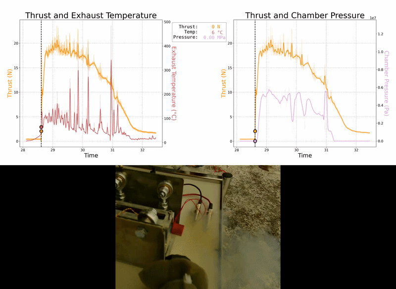

# LTU - Propulsion with Space Applications

The main goal of this lab was to gain first-hand experience on how to plan and execute a controlled launch procedure for a small rocket motor. Although the test involved only the ignition of a small motor, the objective was to simulate the preparation and organization required in real propulsion tests. Additionally, on the test bench there were four sensors (load cell, IR temperature sensor, PT100 temperature sensor, ambient temperature sensor) plus a video camera to collect all of the important data from the rocket motor.

This lab was done in a group of five, and my job was preparing a countdown procedure, mounting and checking the sensors, and collecting all of the data during the test. Afterwards, I was responsible for compiling and analyzing the data into meaningful graphs. The main graphs are shown below.

